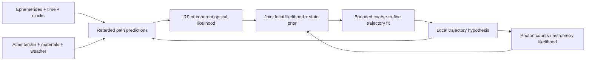

# geoid-atlas

A Rust library for body-scoped geospatial data and time-dependent interferometric forward models. It supports subsurface sites, surface stations, orbiting arrays, and multiple planetary/star systems beneath a common reference frame.

This implementation is a working, dependency-free modeling foundation. It includes local trajectory fitting, recursive state estimation with full covariance, historical smoothing, and synthetic examples. It does not ship measured global datasets, a precision astronomical ephemeris, or an operational real-time sensor pipeline.

```sh
cargo test --locked --all-targets
cargo test --locked --doc
cargo run --locked --example terrain_atlas
cargo run --locked --example hour_array
cargo run --locked --example recursive_tracking
cargo run --locked --example kiwi_observability
```

Rust 1.99.0 is pinned in `rust-toolchain.toml`. All examples and tests work offline once the toolchain is installed.

## Implemented models

| Module | Capabilities |
| --- | --- |
| `coordinates` | Configurable oblate ellipsoids, WGS84 geodetic/ECEF/ENU, Web Mercator, explicit UTM zones/hemispheres, planetary longitude/latitude |
| `frames` | Position/velocity transforms including spin; timestamped frame trees; arbitrary bodies/star systems; linear motion and bound Kepler orbits; `PoseProvider` ephemeris/orientation adapters |
| `time` | Split Julian dates and epochs; explicit TAI, TT, TDB, TCB references; exact conventional TAI/TT offset |
| `raster` | Georeferenced DEMs and RGB DRGs, rotated affine maps, nearest/bilinear sampling, nodata/coverage checks, ESRI ASCII ingestion, explicit vertical datums |
| `gravity` | WGS84 normal/free-air gravity, geoid height conversion, common-frame Newtonian point-mass superposition |
| `rf` | Friis/free-space loss, lognormal power expectations, independent incoherent power sums, homogeneous conducting materials, radio tropospheric refractivity, first-order ionospheric group/phase delays |
| `interferometry` | Signed near-/far-field delay, UVW baseline, delay rate, moving-receiver light time, clock polynomial, Gaussian coherence, special-relativistic Doppler, weak-field Shapiro term, spherical occultation check |
| `atlas` | Body/source/quantity/time/band-scoped fields, provenance, observation/model separation, uncertainty fusion with explicit error-lineage groups, DEM/geoid site placement, DRG sampling |
| `spacetime` | Constant-acceleration and C1 Hermite worldpaths, retarded transmitter-target-receiver paths, coherent integration, channel-specific profile likelihood, Gaussian state priors, joint likelihood blocks, bounded six-parameter local trajectory refinement |
| `estimation` | Full 6×6 state covariance, spin-aware frame uncertainty transforms, white-acceleration prediction, scalar EKF/Joseph updates, innovation gating, unique observation IDs, retarded timing Jacobians, Rauch–Tung–Striebel historical smoothing |
| `calibration` | Joint receiver frequency-scale/offset and transmitter-offset fitting, explicit reference gauge, sparse-cell rank checks, pivoted QR, conditional full parameter covariance |
| `observability` | Clock/dispersive phase basis separability, explicit one-way/monostatic bandwidth cells, conditional nominal frequency ambiguity lattice |

Angles at geodetic boundaries are degrees; rotations and phase are radians. Spatial coordinates are metres, velocities m/s, gravitational parameters m³/s². RF power APIs distinguish watts and dBm. `Geodetic::new(latitude, longitude, height)` uses ellipsoidal height; raster geographic axes are **longitude, latitude**. `Ecef` is Earth-fixed by convention; a generic ellipsoid returns the same Cartesian container in that body's fixed axes.

## Space and time across multiple bodies

A frame tree can contain a common inertial root, multiple stellar-system barycentres, body-centred inertial frames, rotating body-fixed frames, spacecraft frames, and local instruments. Translational ephemerides and body rotations are separate nodes. For example, a Moon orbit belongs under Earth-centred inertial axes, not under rotating Earth-fixed axes.

Each `PoseProvider` supplies the origin position/velocity, local-to-parent rotation, and angular velocity in parent axes at the requested epoch. Transforming velocity includes the angular-velocity cross position term. Frame IDs are graph-specific. Relative transforms traverse the lowest common ancestor so a shared interstellar translation does not destroy a millimetre-scale local baseline through subtraction.

The graph does not label an arbitrary root as ICRF or generate physical ephemerides from a frame name. Supply validated ephemeris and orientation providers for those standards. Kepler orbits are unperturbed two-body approximations, including for simultaneous star systems; they are not an N-body integrator.

Declare a `TimeReference` when constructing the graph. `Epoch` retains whole and fractional seconds separately; use `duration_since`, not subtraction of approximate `seconds()` values. Use `Timestamp`/`JulianDate` to enter observations with an explicit scale. UTC ingestion needs an external leap-second table. TDB/TCB conversions need an external relativistic time model and are rejected if requested without one. TT/TAI differ by the conventional 32.184 seconds. The library provides no automatic proper-time/coordinate-time conversion for spacecraft clocks.

## The hour-long 100-transmitter problem

`hour_array` predicts 100 Earth-fixed transmitters and two orbital receivers at 61 epochs over an hour, with Earth rotation/orbit, a Moon orbit, a moving target craft, and another star/planet system. It solves 12,200 bistatic paths and reports the Sun in Earth-centred, Earth-fixed, Moon-centred, satellite and other-planet frames. These are synthetic geometry predictions, not real observations or a validated solar ephemeris. Geometric paths are reported even when a real body would block them; visibility must be applied separately.

For each transmitted event, the forward model solves

```text
t_scatter = t_emit + |target(t_scatter) - transmitter(t_emit)| / c
t_receive = t_scatter + |receiver(t_receive) - target(t_scatter)| / c
```

These are different events, not three positions evaluated at one timestamp. Apply medium, gravity, instrument, and clock corrections consistently with those events. The provided bistatic solver is vacuum-only; delay corrections are explicit APIs and are not automatically fed back into its event solve. For strongly delayed/dispersive paths, implement a coupled propagation solver.

The Sun's direction in a frame is obtained by transforming its state and subtracting the observer's state at the relevant epoch. Precision apparent directions additionally require source light time, aberration, deflection, and authoritative ephemerides. The Sun is an extended, largely incoherent emitter: a geometric phase centre does not turn all solar emission into a single coherent carrier. Solar imaging requires a brightness/visibility model or an appropriate photon likelihood.

## Continuous sensing and local refinement

Represent a target hypothesis as a continuous worldpath, then predict each instrument's observations from that same path. `HermiteWorldline` preserves position and velocity continuity between timestamped knots; maneuvering tracks can use additional knots or another `Worldline` implementation. Continuity is a useful prior, not proof that a target cannot maneuver or change reflectivity.



`CoherentBistaticLikelihood` phase-aligns measurements against a candidate path and estimates a separate constant complex reflectivity for each calibrated coherent channel. A correct hypothesis can recover signal that an unaligned sum cancels. The test suite verifies the ideal independent-noise standard deviation improves by sqrt(N); it does not claim a measured sensing improvement.

RF and genuinely phase-linked optical fields can be integrated coherently **within a calibrated channel**. Unrelated RF transmitters are not phase-linked merely because their positions are known. X-ray photon counts, optical astrometry, weather observations, and other modalities need their own likelihoods. `NegativeLogLikelihood`, `JointLikelihood`, and `poisson_count_cost` provide the composition points. Represent a measurement once; transforming it into multiple frames creates equivalent descriptions, not independent evidence. Blocks sharing clocks, weather errors, or survey lineage need a joint covariance/calibration model within one independence group.

`refine_trajectory` searches bounded position/velocity neighborhoods in progressively smaller steps. It fits six parameters with fixed acceleration; arbitrary higher-dimensional models can implement their own optimizer using the likelihood interface. `LocalCell` bounds a local spacetime neighborhood. Warm-start successive windows from the last fit and use `GaussianStatePrior` with appropriate process-noise inflation. That local search does not estimate posterior covariance or resolve global phase ambiguities. For Gaussian recursive estimation and historical smoothing, use the separate `estimation` module described below. Changing reflectivity calls for shorter windows or a more expressive reflectivity model.

A real-time deployment still needs calibrated acquisition adapters, buffers with unique observation IDs, clock/ephemeris uncertainty, channel response and target reflectivity models, robust maneuver handling, and runtime throughput validation. No raw acquisition, historical archive, or weather service is fetched implicitly.

## Recursive estimation and historical worldpaths

`TrackState` carries an epoch, a Cartesian position/velocity mean, and a full covariance in the order `[x, y, z, vx, vy, vz]`. Position/velocity and cross-axis correlations are preserved. `Covariance6` validates finite, symmetric, positive-semidefinite inputs using normalized correlations to handle mixed units; the numerical PSD tolerance is 1e-12 in correlation space. Internal symmetric covariance calculations remove floating-point antisymmetry before validation.

`TrackState::predict` uses a local constant-velocity process with continuous white acceleration. Its process-noise inputs are **spectral densities in m²/s³**, not acceleration standard deviations. The resulting covariance includes the dt³/3 position, dt²/2 cross, and dt velocity terms. Use sufficiently local intervals and a nonrotating tracking frame. This process is not an orbital force integrator; a long arc with strong gravitational curvature needs an appropriate dynamics model, not just a coordinate transform.

`MeasurementModel` supplies one scalar prediction, its six-state Jacobian, and measurement noise. `LinearMeasurement` covers exact linear Cartesian observables. `BistaticDelayMeasurement` linearizes the retarded transmitter-target-receiver path about the predicted state, with a locally constant-velocity target and explicit known timing offset. Its central-difference steps must exceed local coordinate/solver precision. The model assimilates **absolute, calibrated timing**; it does not resolve a wrapped carrier-phase ambiguity. Combine the coherent trajectory likelihood for that search with timing constraints as appropriate.

`RecursiveTracker::assimilate` predicts to the measurement epoch and performs a Joseph-form EKF covariance update. An optional squared normalized innovation gate rejects outliers. Duplicate observation IDs and out-of-order epochs are rejected. An unsuccessful operation leaves the tracker unchanged; a gated outlier consumes its ID and advances only the process prediction. IDs are retained for the lifetime of the tracker; a production archive needs an explicit checkpoint/deduplication policy. Simultaneous measurements can be processed at the same epoch, provided their noise is conditionally independent or has been decorrelated. Shared clock, ephemeris, or atmospheric biases are not absorbed automatically into the six target-state variables.

`TrackState::transform` carries the full covariance between frames using the deterministic pose Jacobian, including the spin-induced position/velocity coupling. Frame/clock model uncertainty must be handled separately. Transforming a posterior for presentation does not supply another measurement or justify predicting with the same dynamics in a rotating frame.

For historical reconstruction, retain one final filtered state per distinct epoch and the prior at each next epoch **before** its first observation. Pass those to `smooth_history`. The Rauch–Tung–Striebel backward pass uses later information to update earlier means and covariance without assimilating the same data twice. Prediction covariances must be positive definite; inconsistent timestamps, singular predictions, and incompatible mean transitions are rejected. The smoother uses the same constant-velocity dynamics as the filter. `mean_worldpath` constructs a C1 Hermite path through the smoothed means; covariance remains at the knots and is not silently interpolated.

Run `recursive_tracking` for a reproducible example: 366 noisy bistatic timing observations over an hour, one injected outlier, a six-state recursive estimate, and historical smoothing. In the supplied synthetic local inertial scene, position RMS improves from approximately **1.862 m filtered to 0.857 m smoothed**, and the outlier is rejected. This validates the implementation under its stated Gaussian/independent-noise model; it is not a measured instrument performance claim.

## Source-backed atlas

The [KiwiSDR report case](docs/kiwi_case.md) maps an actual user-provided solve to clock calibration, lag ambiguity, propagation and source-coverage requirements. `kiwi_observability` checks its frequency plan and can audit the local synthesis geometry table. Summary reports are not substituted for the unavailable timestamped observations, and the attachments are not copied into this repository.

Register a body and source before adding a field. Every source has a citation/URI/model specification, an observation-or-model label, and an independence-group identifier. Every layer belongs to one body and quantity, with optional validity bounds. RF power fields include an exact frequency band. Body coordinates, vertical references, frequencies, and data lineage are not merged implicitly.

DEM elevation is either ellipsoidal or orthometric. Convert explicitly using **h = H + N**, with a matching geoid model. Generic planets use `Crs::Planetographic` rasters or a custom reprojecting `ScalarField`; built-in UTM and Mercator are WGS84-only. A planetary geoid requires a specified reference equipotential/rotation, not just an Earth geoid relabeled with another body name.

Fusion uses inverse variance between declared independent Gaussian estimates. Within the same error group, only the smallest-uncertainty estimate contributes, and redundant source IDs are reported. Disagreement inflates formal uncertainty and produces a reduced chi-squared diagnostic. Systematic bias, unknown correlation, and non-Gaussian evidence need a custom model; metadata alone cannot establish trust. Scalar raster uncertainty is supplied by the source adapter, not derived from pixel interpolation.

`ScalarField::sample` includes height and epoch, so adapters can represent local material volumes or time-dependent atmospheric fields as well as 2D tiles. Adding weather fields does not automatically ray-trace them; use them to construct a local propagation model. GeoTIFF/GDAL, DRG file decoding, tiled catalogs, spherical-harmonic gravity files, planetary SPICE kernels, and live feed adapters are extension work. DRG imagery is currently supplied as already georeferenced RGB data; DEM files can be parsed from ESRI ASCII directly.

## Numerical and physical limits

- Newtonian frame transforms are not Lorentz transforms. The Doppler and Shapiro helpers are separate specific corrections, not a complete relativistic spacetime solver.
- Oblate ellipsoids do not represent triaxial bodies or detailed topography. Geographic inversion is rejected near a body's centre, where these coordinates are ambiguous; Cartesian subsurface states remain usable.
- Point-mass gravity and weak-field Shapiro delay are invalid inside an extended body. Normal Earth gravity includes rotation; point-mass gravity does not. Occultation is a separate explicit sphere test.
- Friis requires far-field free-space conditions. Conducting-material loss is homogeneous and excludes interface transmission, multipath and scattering. Plasma terms are first-order, far above cutoff. Tropospheric refractivity is an approximate radio law, not an optical/X-ray law.
- All scalar/vector numerics use f64. Split times preserve fine local intervals, but huge absolute positions still lose small details. Use local frames, differential delays and calibrated residual phase. Absolute interstellar carrier phase computed from a large path length is unsuitable for precision optical interferometry.
- Geometry alone does not identify every unknown clock, phase, position, or target. Data bandwidth, baseline geometry, calibration, ambiguity resolution, and a valid likelihood determine identifiability and attainable precision.

## Validation

The tests cover geodetic round trips including polar/orbital/subsurface points, an external UTM control point, frame velocity/rotation, local precision beneath an interstellar parent, orbital energy, DEM/nodata parsing, gravity, radio/material/weather models, retarded event times, clock and phase signs, time-scale guards, coherent gain, trajectory discrimination, bounded refinement, and atlas evidence isolation. Estimation tests check analytic Kalman/RTS posteriors, full covariance validation, spin coupling, cross-axis updates, outlier/duplicate handling, transactional failures, and retarded timing derivatives. CI also runs the complete synthetic tracking example and its numerical assertions. The examples exercise modeling workflows without network access.

MIT license. Crate import: `geoid_atlas`.
